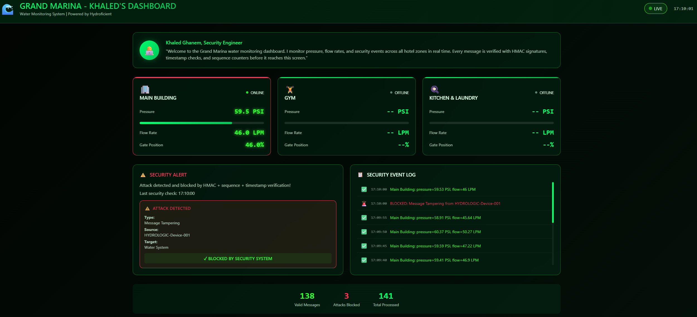
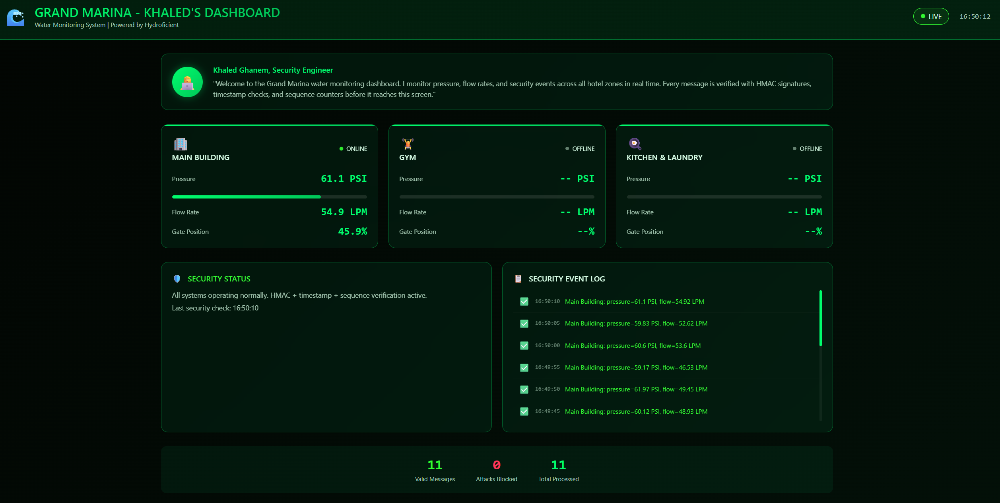

# 🔒 IoT Cyber Defense Pipeline

> **IoT Security Engineering Project** — End-to-end MQTT pipeline with layered cryptographic defenses, live attack simulation, and a real-time threat monitoring dashboard.

[](https://python.org)
[](https://mqtt.org)
[](https://en.wikipedia.org/wiki/Mutual_authentication)
[](https://en.wikipedia.org/wiki/HMAC)

---

## Table of Contents

- [Background](#background)
- [Demo](#demo)
- [What This Project Demonstrates](#what-this-project-demonstrates)
- [System Architecture](#system-architecture)
- [Security Design: Layer by Layer](#security-design-layer-by-layer)
- [Attack Simulation](#attack-simulation)
- [Real-Time Dashboard](#real-time-dashboard)
- [Security Properties Summary](#security-properties-summary)
- [Repository Structure](#repository-structure)
- [Getting Started](#getting-started)
- [Tech Stack](#tech-stack)
- [Key Takeaways](#key-takeaways)

---

## Background

Critical infrastructure gets breached not because attackers are sophisticated, but because the systems defending it aren't. IoT devices talk constantly, often over unencrypted channels, with little to no authentication. In sectors like water utilities, that's not a theoretical risk. It's an active one.

I built this project during a cybersecurity externship on [Extern](https://www.extern.com/) with [Hydroficient](https://www.hydroficient.com/), a company that makes IoT water monitoring systems for hotels, hospitals, and apartment complexes. This is the kind of infrastructure where a faked sensor reading or a replayed shutoff command has real consequences. The goal wasn't to follow a tutorial. It was to engineer a pipeline from scratch, find where it breaks, and fix it layer by layer.

---

## Demo

> A full walkthrough of the pipeline running live, followed by the attack simulator triggering and being caught in real time.


---

## What This Project Demonstrates
 
| Skill Area | What's Shown |
|---|---|
| **Security Engineering** | Layered defense design (TLS → mTLS → HMAC → freshness → sequencing) — each layer closes a gap the previous one leaves open |
| **Cryptography (applied)** | PKI provisioning via `generate_certs.py`, mTLS broker config, HMAC-SHA256 payload signing and verification |
| **Attack Simulation** | 3-phase attacker simulation in `attack_simulator.py`: eavesdrop, inject (bad HMAC), replay (stale + exact) |
| **Systems Programming** | Multi-threaded MQTT subscriber, async WebSocket bridge, real-time event broadcasting with `asyncio` |
| **Operator Tooling** | Live monitoring dashboard connecting MQTT events to a browser UI via WebSocket |
| **PKI Automation** | Full certificate authority scripted in Python (`cryptography` library) — CA, server, device, and test certs, no OpenSSL CLI |

---

## System Architecture

```
┌─────────────────────────────────────────────────────────────────┐
│                        IoT Sensor Layer                         │
│   publisher_defended.py → Simulated water sensor (device-001)   │
│   • Flow rate, pressure, gate valve positions                   │
│   • HMAC-signed payload + sequence number + UTC timestamp       │
└────────────────────────────┬────────────────────────────────────┘
                             │  MQTTS (TLS 1.2+, port 8883)
                             │  mTLS: client cert required
                             ▼
┌─────────────────────────────────────────────────────────────────┐
│                      Mosquitto MQTT Broker                      │
│   • Requires valid CA-signed client certificate                 │
│   • Uses cert CN as device identity                             │
│   • Anonymous connections blocked entirely                      │
└──────────────┬──────────────────────────┬───────────────────────┘
               ▼                          ▼
┌─────────────────────────┐  ┌────────────────────────────────────┐
│   subscriber_defended   │  │   subscriber_dashboard.py          │
│   (CLI validation mode) │  │   + dashboard_server.py            │
│                         │  │   • HTTP :8000 / WS :8765          │
│   Validates:            │  │   • Bridges MQTT → WebSocket       │
│   • HMAC integrity      │  │   • Feeds dashboard.html           │
│   • Timestamp freshness │  └──────────────┬─────────────────────┘
│   • Sequence ordering   │                 ▼
└─────────────────────────┘  ┌────────────────────────────────────┐
                             │         dashboard.html             │
              ▲              │   "Grand Marina" live UI           │
              │              │   • Zone pressure / flow cards     │
┌─────────────────────────┐  │   • Attack alert panel            │
│   attack_simulator.py   │  │   • Real-time event log           │
│   Phase 1 — Eavesdrop   │  └────────────────────────────────────┘
│   Phase 2 — Inject      │
│   Phase 3 — Replay      │
└─────────────────────────┘
```

---

## Security Design: Layer by Layer

The system was built progressively — each layer addresses a specific weakness left open by the previous one.

### Layer 1 — TLS Encryption
Encrypts all MQTT traffic over the wire. Prevents passive eavesdropping of sensor data.

**Tradeoff measured:** TLS handshake adds ~10–15ms overhead per connection — negligible at 5-second sensor intervals, but worth noting for high-frequency applications.

### Layer 2 — Mutual TLS (Device Allowlisting)
Upgrades to **mTLS**: the broker requires a CA-signed client certificate from every connecting device. A device at the right IP, knowing the broker's hostname, still cannot connect without a certificate issued by the Grand Marina CA.

```
# mosquitto_mtls.conf (key directives)
require_certificate true
use_identity_as_username true
allow_anonymous false
```

**What this defeats:** Rogue device spoofing. The `wrong-device.pem` (signed by a different CA) is rejected at TLS handshake — before any application data is exchanged.

### Layer 3 — HMAC-SHA256 Message Authentication
Even a device with a valid certificate could publish forged data. HMAC authentication signs each payload with a shared secret key, binding the message content to a verifiable tag.

```python
# Signing (publisher_defended.py)
hmac_value = hmac.new(SECRET_KEY, payload_bytes, hashlib.sha256).hexdigest()

# Verification (subscriber_defended.py)
if not hmac.compare_digest(expected_hmac, received_hmac):
    raise ValueError("HMAC mismatch — message tampered or forged")
```

**What this defeats:** In-flight tampering and fabricated messages (Phase 2 of the attack simulator).

### Layer 4 — Timestamp Freshness Window
HMAC alone doesn't stop replay attacks — a captured legitimate message has a valid HMAC. A 30-second freshness window rejects any message older than half a minute.

```python
age = (datetime.now(UTC) - msg_time).total_seconds()
if age > 30:
    raise ValueError(f"Stale message ({age:.1f}s old)")
```

**What this defeats:** Stale replay attacks — flooding the subscriber with old "normal" readings to mask an active incident.

### Layer 5 — Strictly Increasing Sequence Numbers
A same-second replay would pass the timestamp check. Per-device monotonically increasing sequence numbers close this gap.

```python
if sequence <= last_sequence[device_id]:
    raise ValueError("Sequence number not increasing — possible replay")
```

**What this defeats:** Exact replay of a recently captured message.

---

## Attack Simulation

`attack_simulator.py` runs three phases against the hardened pipeline to validate each defense:

| Phase | Attack | Defense That Catches It |
|---|---|---|
| Phase 1 — Eavesdrop | Subscribes with a valid cert; reads live traffic | (Demonstrates insider threat; TLS alone insufficient) |
| Phase 2 — Inject | Publishes 200 PSI alert with invalid HMAC | HMAC-SHA256 verification |
| Phase 3 — Replay | Re-publishes captured or backdated message | Timestamp freshness + sequence ordering |


*Attack alert panel triggered during Phase 2 (message injection) and Phase 3 (replay attempt).*

All three phases are detected and rejected. Events appear immediately in the dashboard's attack alert panel.

---

## Real-Time Dashboard

The operator dashboard (`dashboard.html` + `dashboard_server.py`) bridges the MQTT world and the browser via WebSocket:

- **Zone cards** — live pressure and flow rate for Main Building, Pool/Gym, and Kitchen zones
- **Attack alert panel** — lights up with attack classification when a validation failure occurs
- **Event log** — timestamped stream of the last 50 events (valid and rejected)
- **Message counters** — total / accepted / rejected tallies


*Real-time zone monitoring under normal pipeline operation.*

**Attack classification labels:**

| Validation Failure | Dashboard Label |
|---|---|
| HMAC mismatch | Message Tampering |
| Stale timestamp | Replay Attack (stale) |
| Non-increasing sequence | Replay Attack |
| TLS handshake failure | Unauthorized Device |

---

## Security Properties Summary

| Property | Mechanism | Threat Defeated |
|---|---|---|
| **Confidentiality** | TLS 1.2+ on all MQTT traffic | Passive eavesdropping |
| **Device Authentication** | Mutual TLS — CA-signed client certs | Rogue / spoofed devices |
| **Message Integrity** | HMAC-SHA256 with shared secret | In-flight tampering |
| **Freshness** | 30-second timestamp window | Stale replay attacks |
| **Ordering** | Per-device strictly increasing sequence | Exact replay attacks |
| **Visibility** | Real-time WebSocket dashboard | Undetected intrusions |

---

## Repository Structure

```
├── requirements.txt              # Python dependencies (pip install -r requirements.txt)
├── mosquitto_mtls.conf           # Broker config: mTLS enforced, anon blocked
├── generate_certs.py             # Generates the full PKI (CA, server, devices, test certs)
├── publisher_defended.py         # Sensor: HMAC-signed, sequenced, timestamped
├── subscriber_defended.py        # Validator: HMAC + freshness + sequence checks
├── subscriber_dashboard.py       # Validator + dashboard WebSocket integration
├── dashboard_server.py           # HTTP + WebSocket bridge server
├── dashboard.html                # Real-time threat monitoring UI
├── attack_simulator.py           # 3-phase attack demo (eavesdrop / inject / replay)
└── docs/
    ├── dashboard_normal.png  # Dashboard under normal pipeline operation
    └── dashboard_attack.png  # Dashboard during active attack simulation
```

---

## Getting Started

**Prerequisites:** Python 3 and Eclipse Mosquitto installed.

```bash
pip install -r requirements.txt
```

### Step 1 — Generate certificates (first time only)

All TLS certificates are produced by a single script — no OpenSSL CLI required:

```bash
python generate_certs.py
```

This creates the full `certs/` directory with everything the project needs:

| What gets generated | Purpose |
|---|---|
| `ca.pem` / `ca-key.pem` | Grand Marina Root CA (10-year validity) |
| `server.pem` / `server-key.pem` | Broker identity, signed by CA |
| `device-001..003.pem` + keys | Enrolled sensor devices, each signed by CA |
| `expired-device.pem` + key | Pre-expired cert for rejection testing |
| `wrong-ca.pem` / `wrong-device.pem` + keys | Rogue CA + device for attack testing |

### Step 2 — Run the pipeline

Open four separate terminals:

```bash
# Terminal 1 — start the broker
mosquitto -c mosquitto_mtls.conf

# Terminal 2 — start the dashboard backend + subscriber
python subscriber_dashboard.py
# then open http://localhost:8000 in your browser

# Terminal 3 — start the sensor publisher
python publisher_defended.py

# Terminal 4 — (optional) run the attack demo
python attack_simulator.py
```

The dashboard will show incoming sensor data in the zone cards and light up the attack panel when the simulator's inject and replay phases are caught and rejected.

---

## Tech Stack

| Layer | Technology |
|---|---|
| Language | Python 3 |
| MQTT Broker | Eclipse Mosquitto |
| MQTT Client | paho-mqtt |
| Transport Security | TLS / Mutual TLS |
| Application Security | HMAC-SHA256 (`hmac` stdlib) |
| Dashboard Backend | `http.server` + `websockets` |
| Dashboard Frontend | Vanilla HTML / CSS / JS |
| Certificate Authority | Custom PKI — `generate_certs.py` (Python `cryptography` library) |

---

## Key Takeaways

**Security is layered — no single control is sufficient.** TLS prevents eavesdropping but not replay. Certificate auth prevents rogue devices but not insider abuse. HMAC catches tampering but not exact replay. Timestamps catch stale replay but not same-second reuse. Each layer closes the gap left by the one before it.

**Threat modeling before code saves time and sharpens design.** Mapping the attack surface before writing a single line of code meant every design decision had a clear "why." The expired certificate test file exists because "certificate lifecycle" was on the threat model. The rogue CA test exists because "rogue CA" was on the threat model.

**Operator visibility is not optional.** An attack your system silently blocks is one you can't learn from and can't report on. The dashboard makes the system operationally complete — not just technically secure.

---

*Built during the [Hydroficient IoT Cyber Defense Externship](https://extern.com) (Feb–Apr 2026) — a 7-week project simulating a real-world security engineering engagement around critical infrastructure protection.*
